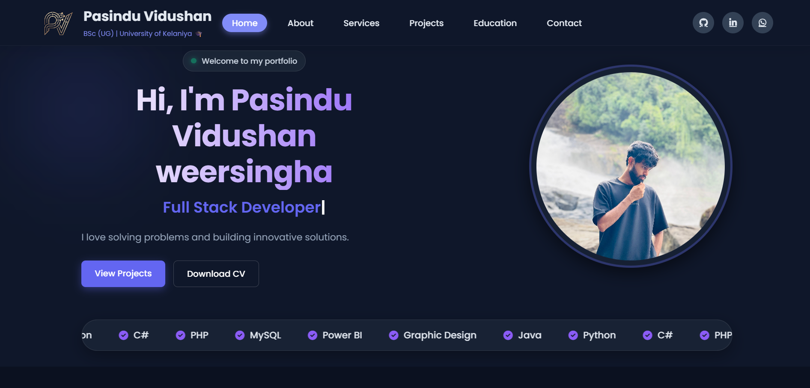
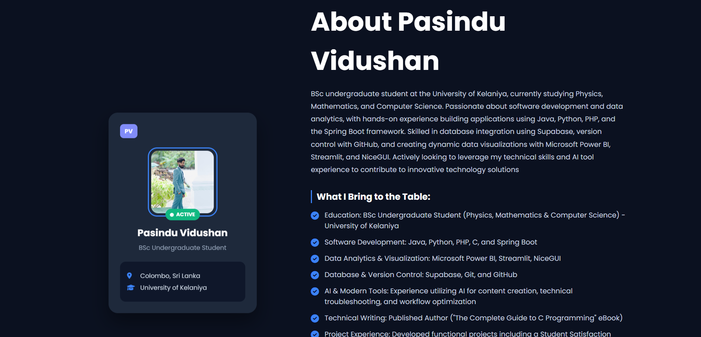
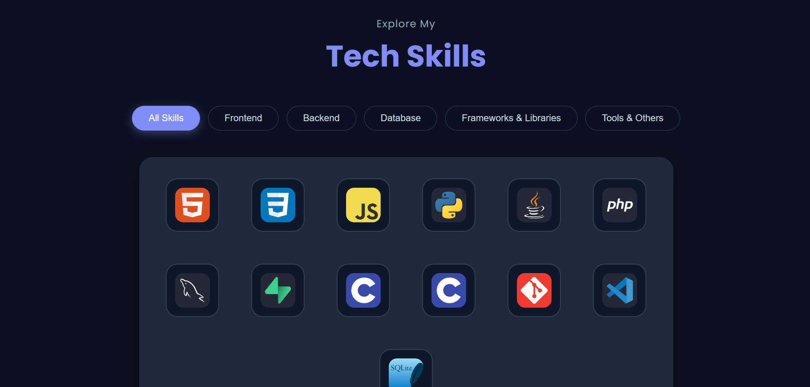

# 👨‍💻 Professional Personal Portfolio

A fully responsive, dynamic personal portfolio website designed to showcase my skills, projects, services, and educational background. Built entirely from scratch, it features a secure custom Admin Panel that allows seamless content management and real-time updates without the need to modify the source code.

### 🔗 Links
- **Live Demo:** [https://pasinduvidushan.infinityfreeapp.com](https://pasinduvidushan.infinityfreeapp.com)
- **GitHub Repository:** [Portfolio_vidushan](https://github.com/pasinduvidushan/Portfolio_vidushan)

---

## 🛠️ Visual Showcase

### 📊 Secured Admin Dashboard
Add, edit, and delete portfolio content in real-time with our custom secure management panel. Perfect for instant updates without altering source code.

<p align="center">
  
</p>
<p align="center">
  
  
</p>

---

### 🚀 Dynamic Project Showcase
Your latest work, beautifully organized. This section dynamically fetches your newest projects from the database, ready to impress recruiters.

<p align="center">
  
</p>
<p align="center">
  
  
</p>

---

## ✨ Key Features

- **Dynamic Content Management:** Add, edit, or delete portfolio projects and services directly from the admin dashboard.
- **Secure Admin Panel:** Custom-built authentication system with PDO database connections to prevent SQL injection.
- **Mobile-First Responsive Design:** Fully optimized for all screen sizes using CSS media queries and Flexbox.
- **Interactive UI/UX:** Smooth scrolling, animated transitions, and a modern glass-morphism header design.
- **Advanced Security:** Implemented custom routing, `robots.txt` configuration, and `noindex` meta tags to secure admin directories and prevent search engine indexing of sensitive areas.

---

## 🛠️ Technologies Used


- **Frontend:** HTML5, CSS3, JavaScript (Vanilla)
- **Backend:** PHP 
- **Database:** MySQL
- **Icons & Fonts:** FontAwesome, Google Fonts
- **Version Control:** Git & GitHub

---

## ⚙️ Local Setup Instructions

If you want to run this project locally on your machine, follow these steps:

1. **Clone the repository:**
   ```bash
   git clone [https://github.com/pasinduvidushan/Portfolio_vidushan.git](https://github.com/pasinduvidushan/Portfolio_vidushan.git)